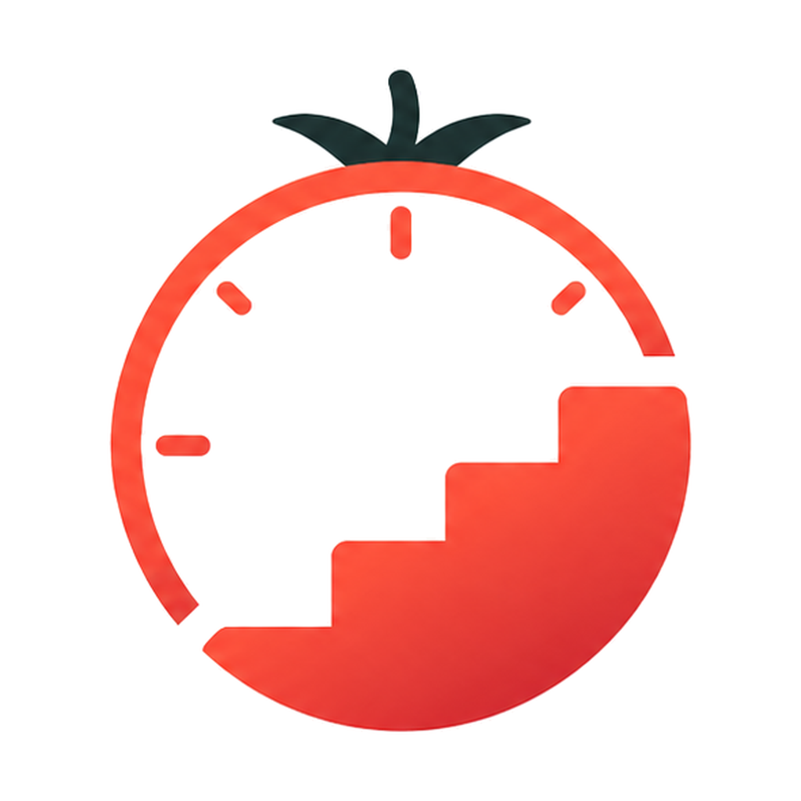
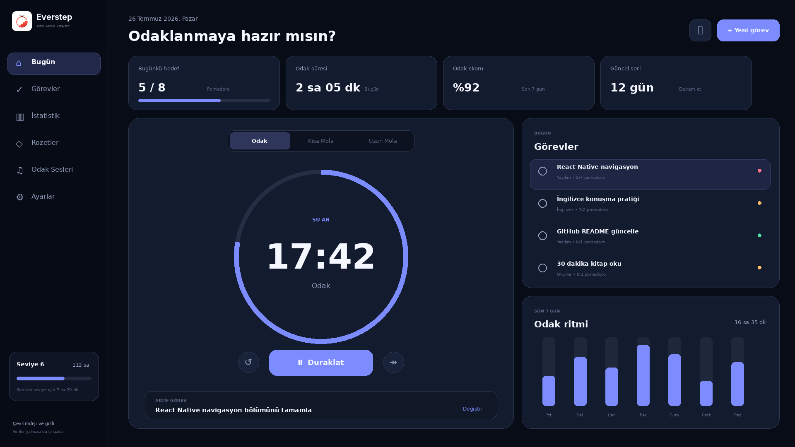
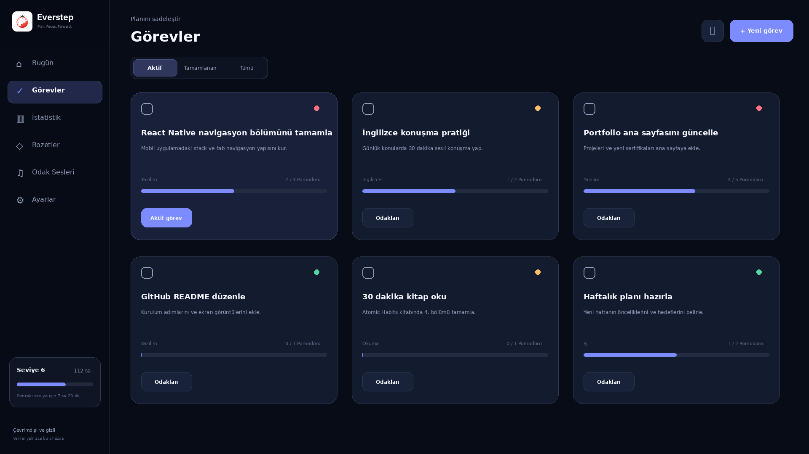
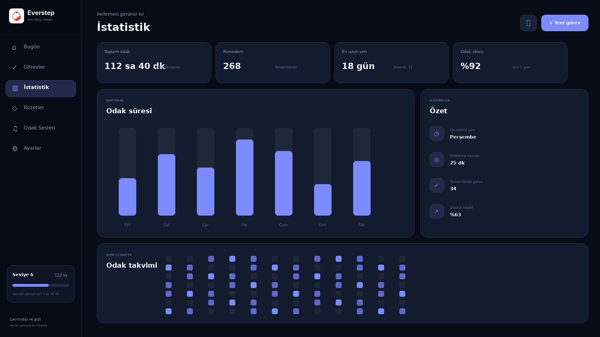
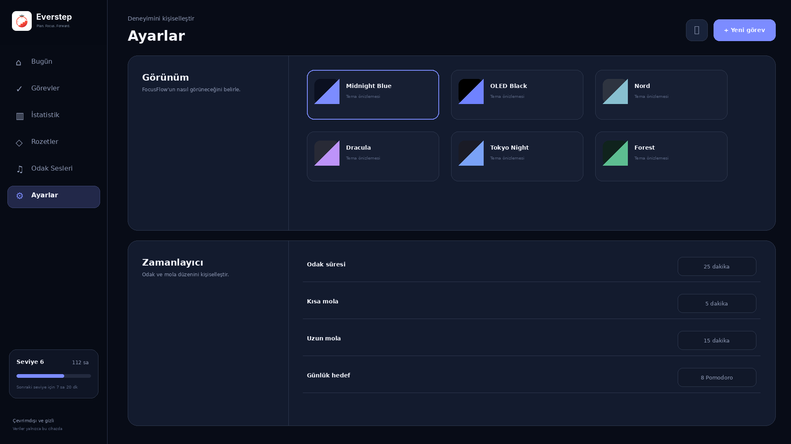

<p align="center">
  
</p>

<h1 align="center">Everstep</h1>

<p align="center">
  An offline Pomodoro timer for Windows with task planning, focus statistics, and ambient sound.
</p>

<p align="center">
  <a href="https://apps.microsoft.com/detail/9P6B9VH16X02">Microsoft Store</a> ·
  <a href="https://github.com/batuhanzorbeyy/everstep/issues">Issues</a> ·
  <a href="SECURITY.md">Security</a>
</p>



Everstep keeps the timer, tasks, and focus history in one place without requiring an account. Everything works offline and stays on the device unless the user chooses to export it.

## Features

- Custom focus, short-break, and long-break durations
- Task planning with categories, priorities, notes, and Pomodoro estimates
- Daily goals, streaks, focus score, weekly charts, and a 12-week heatmap
- Six built-in themes plus custom application and dashboard palettes
- Offline rain, cafe, thunderstorm, wind, ocean, forest, and fireplace soundscapes
- White, pink, and brown noise generated with the Web Audio API
- Native notifications, system tray controls, taskbar progress, and always-on-top mode
- User-initiated JSON backup/import and CSV/PDF reporting
- Turkish, English, Spanish, Japanese, German, Italian, and Azerbaijani interfaces

## Screens

| Tasks | Statistics | Appearance |
| --- | --- | --- |
|  |  |  |

## Privacy

Everstep has no accounts, advertising, analytics, or cloud synchronization. Application data is stored locally. Exports are created only after the user chooses a destination through a Windows file dialog.

The Electron renderer runs with Node.js integration disabled, context isolation enabled, and Chromium sandboxing enabled. Production network requests, unexpected navigation, embedded webviews, permission requests, and new windows are blocked. The implementation details are documented in [SECURITY.md](SECURITY.md).

## Built with

- Electron
- React
- TypeScript
- Vite
- Vitest
- Electron Forge

## Run locally

Requirements: Windows 10/11, Node.js 22 or newer, and npm.

```powershell
npm ci
npm run dev
```

The convenience launcher `START_EVERSTEP.bat` performs the same setup on Windows and then starts the development build.

## Verify a change

```powershell
npm test
npm run build
npm run security:audit
```

`npm run build` includes TypeScript validation, the production frontend build, and Everstep's Electron security checks.

## Build for Windows

Before packaging, add the licensed recordings described in [public/audio/README.md](public/audio/README.md). The packaging commands stop with a clear error if any release audio file is missing.

Create a portable ZIP package:

```powershell
npm run make:zip
```

Create an MSIX package for Microsoft Store submission:

```powershell
.\BUILD_MSIX.ps1 `
  -IdentityName "YOUR_STORE_IDENTITY" `
  -Publisher "YOUR_STORE_PUBLISHER" `
  -PublisherDisplayName "YOUR_PUBLISHER_NAME"
```

Generated packages are written under `out/make` and are intentionally excluded from Git.

## Ambient audio

The Microsoft Store release bundles seven natural ambience recordings sourced from Pixabay. The public repository does not redistribute the raw MP3 files; [AUDIO_CREDITS.md](AUDIO_CREDITS.md) records every creator, source page, and license, while [public/audio/README.md](public/audio/README.md) explains local setup. White, pink, and brown noise are generated at runtime with the Web Audio API.

## Contributing

Bug reports and focused pull requests are welcome. Please read [CONTRIBUTING.md](CONTRIBUTING.md) before opening a change. Security reports should follow [SECURITY.md](SECURITY.md) and must not be posted as public issues.

## License

Everstep's source code and project-owned visual assets are available under the [MIT License](LICENSE). Third-party ambient recordings retain their original license and are documented separately in [AUDIO_CREDITS.md](AUDIO_CREDITS.md). Copyright © 2026 Batuhan Zorbey Mermer.
